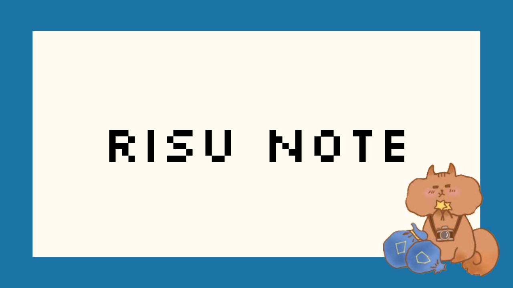

<div align="center">
    <h1>RISU NOTE</h1>
    
</div>
    
---

## 📎 概要
### My First Blog made with Gatsby!
[@lovelovetrb](https://lovelovetrb.com) のブログサイトです！  
Reactベースの静的サイトジェネレータである[Gastby.js](https://www.gatsbyjs.com/)を用いて構築されました。

### 記事について
記事はMarkdownで記述され、/content内に格納されます。  
このディレクトリは、別の[記事管理用リポジトリ](https://github.com/lovelovetrb/lovelovetrb-tech-article)の内容が格納されており、/content/blogがgitのサブモジュールとして管理されています。
なお、記事管理用リポジトリには、mainブランチへのpush時にrepository_dispatchを発行し、このリポジトリに対して記事更新を通知します。  
記事更新が通知されると、このリポジトリは記事の更新のためのブランチ作成・コミット・mainブランチに対するPR作成をGithub Actionsにより自動で行います。
詳しくは、[こちら](./.github/workflows/article_update.yaml)を参照してください。

## 💫 利用技術
- Framework: [Gastby.js](https://www.gatsbyjs.com/)
- Package Maneger: [Bun](https://bun.sh/)
- Linter: [Biome](https://biomejs.dev/ja/)

## 💻セットアップ
1. パッケージのインストール
```bash
bun install
```

2. 開発用サーバーの起動
```
bun run dev
```

