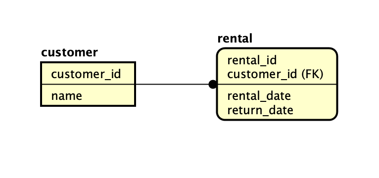
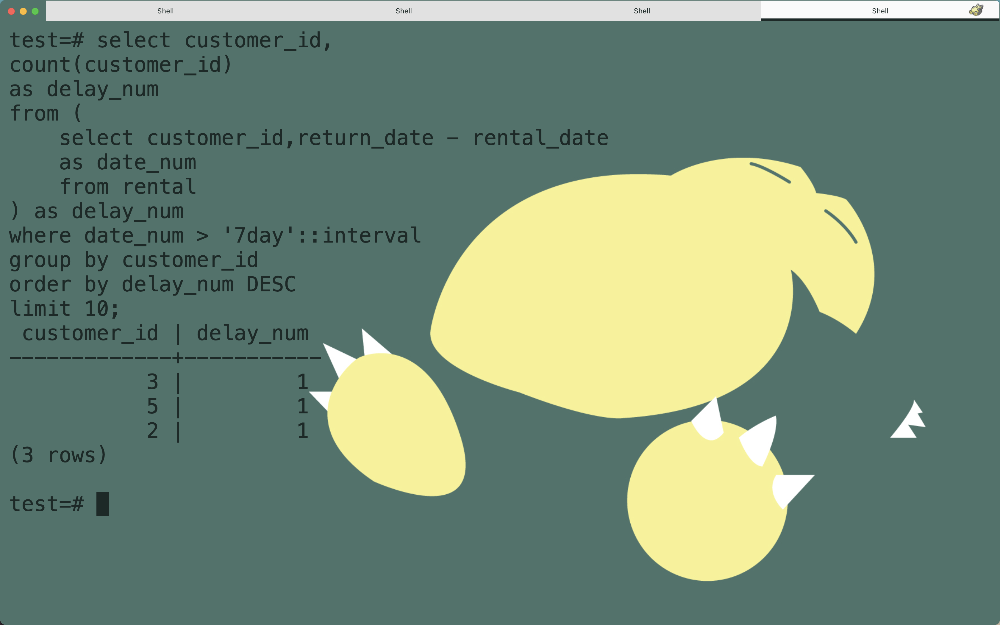

## Postgrsql で日付の計算をしたい

postgresql で timestamp 型で格納された値をそれぞれ計算したいという時を考えます．

ユースケースとしては以下の様な感じです．

> - レンタル DVD 店において，レンタルの詳細を保持するテーブルと顧客情報を保持するデータベースがある
> - DVD のレンタル期間は 7 日であり，遅延する顧客がいる．
> - 最新のレンタル履歴から，遅延回数の多い 10 名を調べ，ブラックリストを作成したい

作成したデータベースの ER 図は以下の通りです．



各テーブルの内容は以下の通りです．

```
test=# \d customer
                     Table "public.customer"
   Column    |       Type        | Collation | Nullable | Default
-------------+-------------------+-----------+----------+---------
 customer_id | integer           |           | not null |
 name        | character varying |           |          |
Indexes:
    "customer_id_key" PRIMARY KEY, btree (customer_id)
Referenced by:
    TABLE "rental" CONSTRAINT "rental_customer_id_fkey" FOREIGN KEY (customer_id) REFERENCES customer(customer_id)
```

```
test=# \d rental
                           Table "public.rental"
   Column    |            Type             | Collation | Nullable | Default
-------------+-----------------------------+-----------+----------+---------
 rental_id   | integer                     |           | not null |
 customer_id | integer                     |           |          |
 rental_date | timestamp without time zone |           |          |
 return_date | timestamp without time zone |           |          |
Indexes:
    "rental_id_key" PRIMARY KEY, btree (rental_id)
Foreign-key constraints:
    "rental_customer_id_fkey" FOREIGN KEY (customer_id) REFERENCES customer(customer_id)
```

用意したデータは以下の通りです．

```sql
select * from customer;

 customer_id |  name
-------------+---------
           1 | Yamada
           2 | sato
           3 | enomoto
           4 | hamada
           5 | seto

(5 rows)
```

```sql
select * from rental;

 rental_id | customer_id | rental_date | return_date
-----------+-------------+-------------+-------------
         1 |           4 | 2022-01-01  | 2022-01-05
         2 |           5 | 2022-01-02  | 2022-01-11
         3 |           3 | 2022-01-03  | 2022-01-09
         4 |           2 | 2022-01-04  | 2022-01-07
         5 |           4 | 2022-01-05  | 2022-01-08
         6 |           5 | 2022-01-06  | 2022-01-10
         7 |           1 | 2022-01-07  | 2022-01-12
         8 |           2 | 2022-01-08  | 2022-01-16
         9 |           1 | 2022-01-09  | 2022-01-14
        10 |           3 | 2022-01-10  | 2022-01-19

(10 rows)
```

ここで自分は where 句を用いて返却日と貸出日との差が 7 であるものを求めれば良いのかなと思いました．
そこで実行した SQL がこちら

```sql
select customer_id,count(customer_id) as delay_num
from (select customer_id,return_date - rental_date
as date_num
from rental) as delay_date
where date_num > 7
group by customer_id
order by delay_num DESC
limit 10;
```

しかしながら，得られた結果こちら...


[Postgresql のリファレンス](https://www.postgresql.jp/document/10/html/functions-datetime.html)によれば，Timestamp 型で減算を行った場合，出力が **interval 型**になるそうで，比較する場合，比較元の値を **Timestamp 型にキャストしてあげる必要がある**様です．

厳密な型定義があるんですね...

ということで，改善したコードがこちら

```sql
select customer_id,count(customer_id) as delay_num
from (select customer_id,date_trunc('day',return_date) - date_trunc('day',rental_date)
as date_num
from rental) as foo
where date_num > '7day'::interval
group by customer_id
order by delay_num DESC limit 10;
```

where 句で条件を指定し，値を比較する際に `::interval` とすることで，interval 型に値をキャストしています．

この様にして得られた結果がこちら．



思った通りの結果が得られました！
